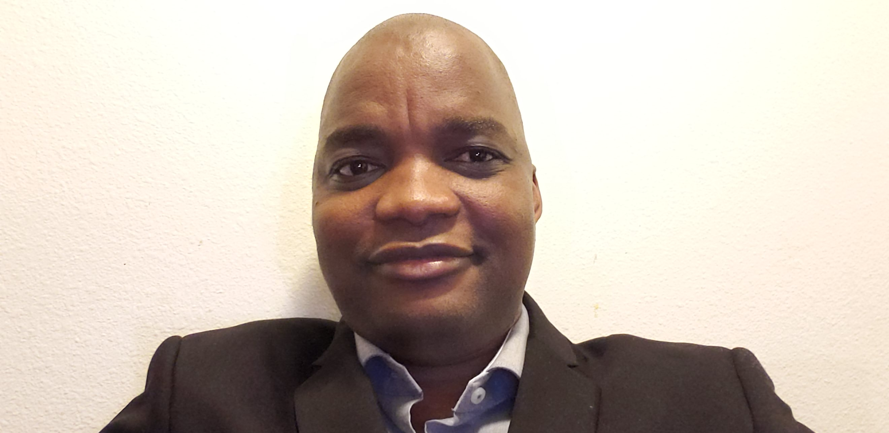

# Aside

<!-- {width="100%"} -->

## Contact Info {#contact}

- <i class="fa fa-envelope"></i> [fredook15@gmail.com](mailto:fredook15@gmail.com){.email}
- <i class="fa fa-phone"></i> +1 (678) 886-8705
-   <i class="fa fa-github"></i> [github.com/Ouo15](https://github.com/Ouo15)
-   <i class="fa fa-linkedin"></i> [frederic-oke-agbo-289ba434](https://www.linkedin.com/in/frederic-oke-agbo-289ba434/)
-   <i class="fa fa-twitter"></i> [fredook15](https://twitter.com/fredook15)

## Skills {#skills}

-   Skilled in collaborating with team to provide tailored solutions.

-   Skilled in machine learning and predictive modeling for risks investigation and quantification.

-   skilled in R, SQL, Markdown, Shiny, Version Control.

-   Robust development of data cleaning, preprocessing and visualizations tools.

-   Systematic literature review, Planning and Evaluation of Health System.

-   Research Designs: Clinical, Epidemiological, and Survey.

-   Spoken Languages: English(Fluent), French(Fluent), Goun(Fluent).

# Main

## Frederic OKE-AGBO {#title}

### Risk Manager - Actuarial Data Scientist

Frederic OKE-AGBO is a Actuarial student and Data Scientist, passionate about holistic investigation of financial securities risks using data driven methods. Has passed all of the required Society of Actuary Exams to achieve Associate of the Society of Actuaries (ASA) designation and has finished Fundamentals of Actuarial Practice (FAP) modules.  

## Experience {data-icon="laptop"}

### Biometric Risks Modeling, Experience Analysis

SCOR GLOBAL Re

Charlotte, NC, USA

Nov 2021 - Present

-   Developed model to quantify mortality trend from Cancer screening delay as a consequence of COVID impacts on US Health System. This is one component that goes into several other  used to develop holistic mortality trend assumption.
-   Developed risk factors embedded Causes of death Mortality Improvement model to better inform mortality improvement that facilitate Expert Judgment.
-   Streamlined assumptions validation process by automating the data preprocessiing and models calibration using R Shiny.
-   Lead the development of predictive models as a basis to develop data driven risks knowledge associated with mortality, morbidity and lapse for assumption development.
-   Enriched the data dimensions on mortality risks by using publicly available data to learn about the distribution channels and Socioeconomic landscape in which financial security products were sold by our clients.
-   Refined assumptions to be used for pricing,  in-force optimization and modelling for valuation.

### Actuarial Associate

American Equity, Investment and Life Insurance

Des Moines, IA, USA

Sept 2020 - Nov 2021

-   Designed actuarial models' data using SQL and Power BI that improve the granularity of projection of models to track the company's Assets and Liabilities.\
-   Developed assumptions' models for Partial Withdrawals using ensemble Machine Learning techniques that increase the accuracy on the old model by 50%.
-   Used comparative models development techniques to established the data driven predictive model model for assumption on Life Income Rider Utilization. The model increase the accuracy on the old model by 25%.

### Graduate Teaching Assistant

University of Iowa

Iowa, USA

Aug 2018 - Sept 2020

-   Prepared lessons, summarized key learning points, provided academic support, conveyed complex concepts.
-   Taught students how to apply statistical concepts to solve real world business problems.

### Public Health Analyst

CREC

Cotonou, Benin

Feb 2011 - Aug 2017

-   Used appropriate statistical methods to design and analyze data from a cohort study that tracks the effectiveness of Long Lasting Insecticidal Nets (LLINs).
-   Used survial, logistic and Poisson regression models to estimate life expectancy and to detect the factors associated with loss of physical and chemical integrity of LLINs.

\newpage

## Education {data-icon="graduation-cap" data-concise="true"}

### University of Iowa

MSc, Actuarial Science

Iowa, USA

2020

### University Libre de Brussels

Master of Public Health (Dist), Public Health Methodologies

Brussels, Belgium

2015

### University d'Abomey-Calavi

BSc in Mathematics

Abomey-Calavi, Benin

2008

## Volunteering Life {data-icon="file"}
<!-- <i class="fa-solid fa-hands-holding-child"></i>  -->

### Member of Medical Reserve Corps

DeKalb Department of Public Health

Georgia, USA

Dec 2015 - Present

Participated in training on incident preparedness and management, to support the local community during times of disasters

<!-- N/A -->

<!-- Dec 2015 - Present -->

<!-- **N. Rennie**, C. Cleophas, A. M. Syksulski, F. Dost -->

<!-- - A full list of publications and conference presentations is available on my website: [nrennie.rbind.io](https://nrennie.rbind.io). -->

## Awards {data-icon="trophy"}

### Robert H Taylor-Knowler Award

Outstanding achievement in Life Contingencies.

N/A

Apr 2020

::: aside
Updated: `r format(Sys.time(), '%b %d, %Y')`.
:::
